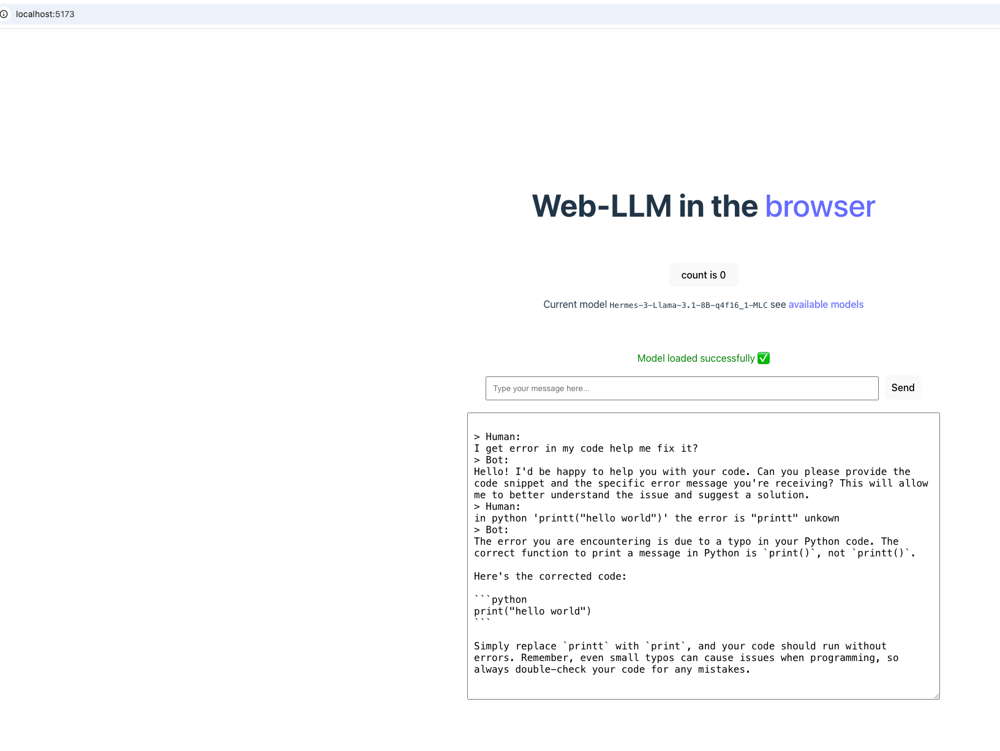

# LLM in the browser 

A very light demo of an LLM model runnign the browser. 

To run `npm run dev` 

**How it works: **

Based on [web-llm](https://github.com/mlc-ai/web-llm) allows using LLM's in the browser easily with pre-compiled models. 
The models are compiled to WebAssembly using [MLC LLM](https://llm.mlc.ai/).  

- Available models [link](https://github.com/mlc-ai/web-llm/blob/main/src/config.ts#L293) out of the box.
- Tool calling [linl](https://github.com/mlc-ai/web-llm/tree/main/examples/function-calling) (still very much WIP but already works).

